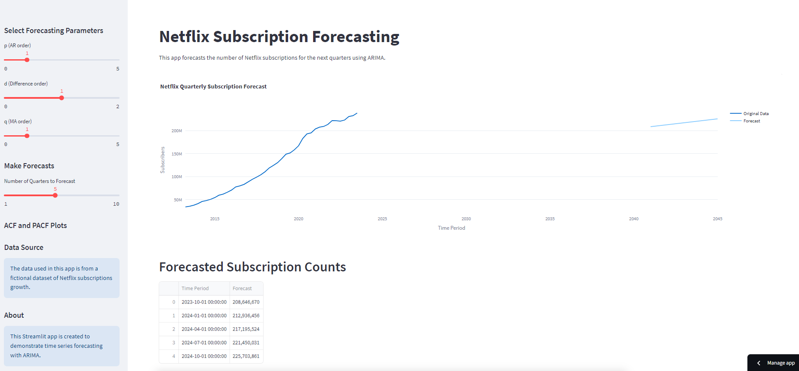

# Netflix Subscription Forecasting with Streamlit

This Streamlit app allows you to forecast the number of Netflix subscriptions for future quarters using the ARIMA time series forecasting model. You can interact with the app to adjust forecasting parameters, view forecasts, and explore the historical subscription data.



## Table of Contents

- [Netflix Subscription Forecasting with Streamlit](#netflix-subscription-forecasting-with-streamlit)
  - [Table of Contents](#table-of-contents)
  - [Installation](#installation)
  - [Usage](#usage)
  - [App Features](#app-features)
  - [Data Source](#data-source)
  - [License](#license)

## Installation

1. Clone this repository to your local machine:
   ```shell
   git clone https://github.com/your-username/netflix-subscription-forecast.git
   ```

2. Navigate to the project directory:
   ```shell
   cd netflix-subscription-forecast
   ```

3. Install the required Python libraries using pip:
   ```shell
   pip install -r requirements.txt
   ```

## Usage

1. Run the Streamlit app using the following command:
   ```shell
   streamlit run app.py
   ```

2. Open your web browser and navigate to the URL displayed in the terminal (typically, http://localhost:8501).

3. Use the Streamlit app to interact with the forecasting model:
   - Adjust ARIMA parameters (p, d, q) in the sidebar.
   - Select the number of quarters to forecast.
   - View the forecasted subscription counts and visualizations.
   - Explore ACF and PACF plots for model analysis.

4. Customize the app as needed for your specific use case.

## App Features

- **Adjustable ARIMA Parameters:** Users can modify the ARIMA model's parameters (p, d, q) to fine-tune the forecasting process.

- **Flexible Forecasting:** You can choose the number of quarters to forecast, providing flexibility in planning.

- **Visualizations:** Interactive plots display both historical subscription data and forecasted values, helping users understand trends.

- **Model Analysis:** ACF and PACF plots are available for model analysis, aiding in parameter selection.

- **Data Exploration:** Users can explore the historical Netflix subscription data and understand its patterns.

## Data Source

The data used in this app is from a fictional dataset of Netflix subscriptions growth. The dataset contains subscription counts at the start of each quarter from 2013 to 2023.

## License

This project is licensed under the MIT License - see the [LICENSE](LICENSE) file for details.